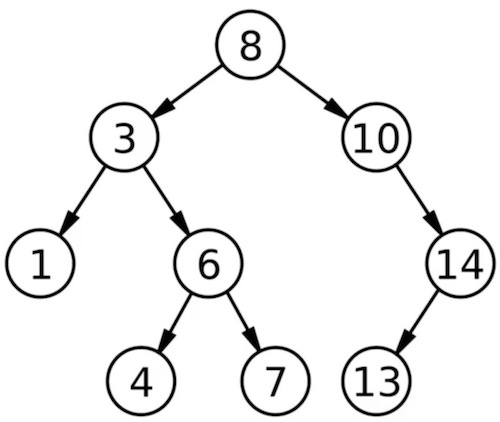
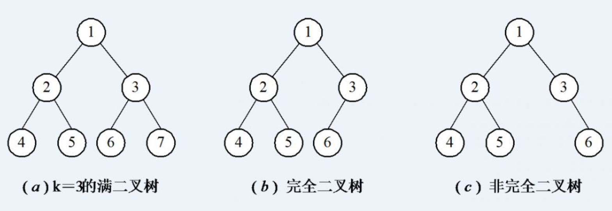
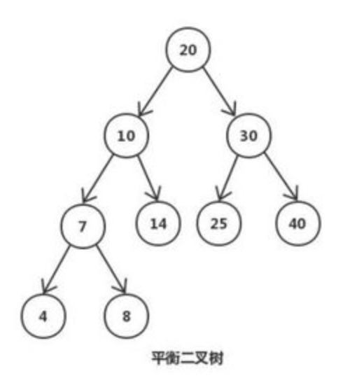

<h1>二叉树</h1>

定义：在计算机科学中，二叉树是每个结点最多有两个子树的树结构。通常子树被称作“左子树”（left subtree）和“右子树”（right subtree）。二叉树是数据结构中非常重要的内容，二叉树常被用于实现二叉查找树和二叉堆。

<h1>相关术语</h1>

树的结点（node）：包含一个数据元素及若干指向子树的分支;

根结点（root node）：树的一个组成部分，也叫树根。所有非空的二叉树中，都有且仅有一个根结点。它是同一棵树中除本身外所有结点的祖先，没有父结点。

孩子结点（child node）：结点的子树的根称为该结点的孩子;

兄弟结点（brother node）：同一双亲的孩子结点;

结点层（node layer）：根结点的层定义为1；根的孩子为第二层结点，依此类推；

堂兄结点（cousin's node）：同一层上结点；

叶子结点（leaf node）：也叫终端结点，是度为0的结点；

祖先结点（ancestor node）: 从根到该结点的所经分支上的所有结点子孙结点，以某结点为根的子树中任一结点都称为该结点的子孙

树的深度（depth of tree）：二叉树中的最大叶子结点所在的层;

<h1>二叉树性质</h1>
  
1. 在非空二叉树中，第i层的结点总数不超过，i>=1;

  
2. 深度为h的二叉树最多有个结点(h>=1)，最少有h个结点；

  
3. 对于任意一棵二叉树，如果其叶结点数为N0，而度数为2的结点总数为N2，则N0=N2+1；

  
4. 具有n个结点的完全二叉树的深度为（注：[ ]表示向下取整）

  
5. 有N个结点的完全二叉树各结点如果用顺序方式存储，则结点之间有如下关系：

    
&nbsp;&nbsp;&nbsp;&nbsp;(1)若I为结点编号则 如果I>1，则其父结点的编号为I/2；

    
&nbsp;&nbsp;&nbsp;&nbsp;(2)如果2*I<=N，则其左儿子（即左子树的根结点）的编号为2*I；若2*I>N，则无左儿子；

    
&nbsp;&nbsp;&nbsp;&nbsp;(3)如果2*I+1<=N，则其右儿子的结点编号为2*I+1；若2*I+1>N，则无右儿子;

  
6. 给定N个节点，能构成h(N)种不同的二叉树。h(N)为卡特兰数的第N项。h(n)=C(2*n，n)/(n+1);

  
7. 设有i个枝点，I为所有枝点的道路长度总和，J为叶的道路长度总和J=I+2i;

<h1>分类</h1>

<b>满二叉树：</b>除了叶结点外每一个结点都有左右子叶且叶子结点都处在最底层的二叉树;

<b>完全二叉树：</b>若设二叉树的高度为h，除第 h 层外，其它各层 (1-h-1) 的结点数都达到最大个数，第h层有叶子结点，并且叶子结点都是从左到右依次排布;

<b>非完全二叉树：</b>若设二叉树的高度为h，除第 h 层外，其它各层 (1-h-1) 的结点数都达到最大个数，第h层有叶子结点，并且叶子结点不是从左到右依次排布;

<b>平衡二叉树(AVL)：</b>又被称为AVL树，它是一棵二叉排序树，且具有以下性质：它是一棵空树或它的左右两个子树的高度差的绝对值不超过1，并且左右两个子树都是一棵平衡二叉树。

<h1>应用场景</h1>

1. 搜索引擎

2. 文件系统

3. 游戏

4. 树形菜单

<h1>排序二叉树</h1>

排序二叉树，又称二叉查找树，亦称二叉搜索树。

<h1>遍历顺序(递归/非递归)</h1>
  <h2>1. 先序遍历</h2>
  	
首先访问根节点，再遍历左子树，最后遍历右子树；

  <h2>2. 中序遍历</h2>
  	
首先遍历左子树，然后访问根结点，最后遍历右子树；

  <h2>3. 后序遍历</h2>
  	
首先后序遍历左子树，再后序遍历右子树，最后访问根节点；

  <h2>4. 层次遍历</h2>
  	
即按照层次访问，通常用队列来做。访问根，访问子女，再访问子女的子女（越往后的层次越低）（两个子女的级别相同）
